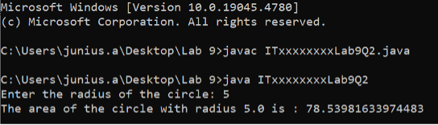

  

    
  

**Question 1 (Tutorial 7 -- Q1)**

**Expected Output:**
  

    
  

**Expected Output:**

  

    
  

**Question 2 (Tutorial 7 -- Q2)**

 **Expected Output:**

  

    
  

  **Question 3 (Tutorial 7 -- Q3)**
  

 **Expected Output:**

  

    
  

**Question 4 (Tutorial 7 -- Q4)**

 **Expected Output:**

  

    
  

  
  

    
  

