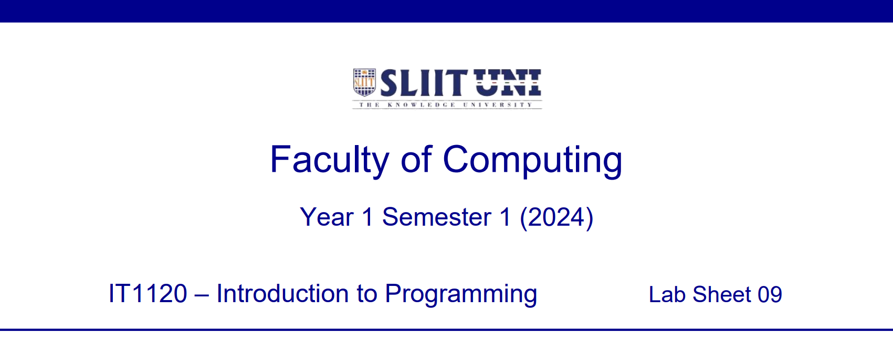
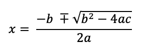
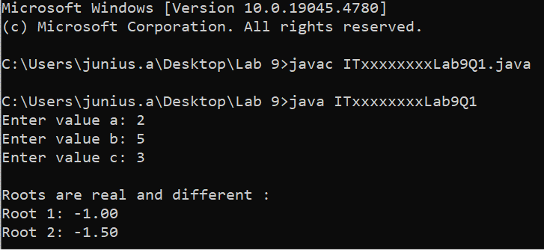
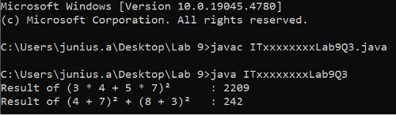
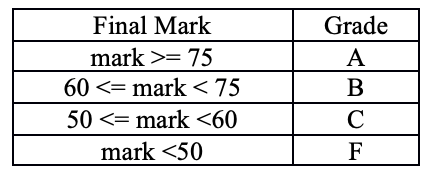
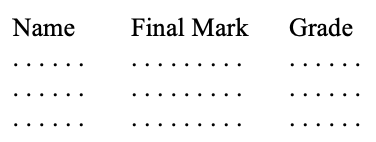
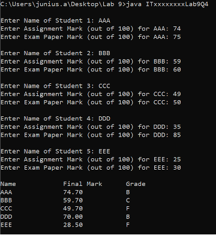

  

    
  

**Question 1 (Tutorial 9 -- Q1)**

> The 'Quadratic Equation' is given below.

  

    
  

> Write a Java program to input any three values for a, b, c and to
> calculate the x value. Hint: Use ***pow()*** and ***sqrt()*** methods
> in Java Math class.
>
> Save the file inside **'Lab 9'** folder as: **ITxxxxxxxxLab9Q1.java**
> Replace 'ITxx xxx xxx' of the filename, with your own Student ID.
> 

**Expected Output:**
  

    
  

**Question 2 (Tutorial 9 -- Q2)**

Write a Java method called circleArea**()** that take the radius of a
circle as an argu-ment/parameter, then calculate area and return the
area.

In the Main Method, read the radius value as an user input via keyboard,
then call the **circleArea()** method to display the result.

Save the file inside **'Lab 9'** folder as: **ITxxxxxxxxLab9Q2.java**
Replace 'ITxx xxx xxx' of the filename, with your own Student ID.

 **Expected Output:**

  

    
  

  **Question 3 (Tutorial 9 -- Q3)**

  Write three Java methods do the following

> • **add()** -- add two integers pass as parameters and return the result.
> • **multiply()** -- multiply two integers pass as parameters and return the result.
> • **square()** -- receive an integer as a parameter and return the result after multiplying the number by itself.

Use the above methods in the Main Method to calculate the result of the following mathematical expressions:

> i. (3 *∗*4 + 5 *∗*7)2
> ii. (4 + 7)2+ (8 + 3)2

Save the file inside **'Lab 9'** folder as: **ITxxxxxxxxLab9Q3.java**

Replace 'ITxx xxx xxx' of the filename, with your own Student ID.

 **Expected Output:**

  

    
  

**Question 4 (Tutorial 9 -- Q4)**

> a\) Write a Java method called **calcFinalMark()** to calculate the final mark of the subject. When calculating the final mark, 30% is taken from the assignment mark and 70% is taken from the exam paper mark. Method should return the final mark
>
> 
> b\) Write a method called **findGrades()** to return the grade
> obtained for the given final mark. Grades are calculated as follows:

  

    
  

> c\) Write a method called **printDetails()** to print the Name, Final
> Mark and Grade of a student.
>
> Your output should be as follows:

  

    
  

  
> d\) In your Main Method, ask the user to enter the **Name,
> Assignment** Mark (out of 100) and the **Exam Paper Mark** (out of
> 100) of the 5 students from the keyboard.
>
> Display the *Name*, *Final Mark* and *Grade* of a student.
>
> *Hint: Use the methods written in section **b)** and **c)***

Save the file inside **'Lab 9'** folder as: **ITxxxxxxxxLab9Q4.java**

Replace 'ITxx xxx xxx' of the filename, with your own Student ID.

 **Expected Output:**

  

    
  

  
  

    
  

